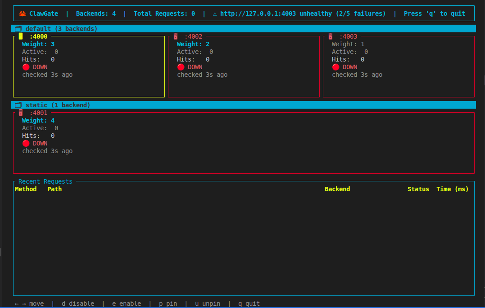

# 🦀 ClawGate

A learning-driven API gateway built in Rust — featuring smart routing, circuit breakers, JWT auth, canary deployments, and a live terminal dashboard.



---

## Features

| Feature | Description |
|---------|-------------|
| **Pass-through proxy** | Forwards all incoming HTTP requests to backend servers |
| **Multiple load balancing algorithms** | Round-robin, weighted round-robin, least connections, IP-hash sticky sessions |
| **Path-based routing** | Route `/api/*` to one backend pool and `/static/*` to another |
| **Header-based routing** | Route on any custom header (`X-Version`, `X-Tenant-ID`, etc.) |
| **Canary / A-B traffic splitting** | Send X% of traffic to a canary backend, rest to stable — per route |
| **Active health checks** | Background task pings every backend; unhealthy ones are automatically skipped |
| **Circuit breaker** | Trips after N consecutive failures, enters HalfOpen probe state, auto-recovers |
| **JWT authentication** | Validates HS256 tokens — checks `exp`, `iss`, and configured required claims |
| **Middleware stack** | TraceLayer logging, BufferLayer, global RateLimitLayer, JWT auth |
| **Hot-reload config** | Edit `config.yaml` while running — backends update instantly, no restart needed |
| **Live TUI dashboard** | Per-server hit counts, active connections, circuit state, health indicators, request log |
| **Manual backend control** | `←/→` to select, `d`/`e` to disable/enable, `p`/`u` to pin/unpin via TUI keyboard |

---

## Requirements

- [Rust](https://rustup.rs/) (stable, 1.75+)
- Cargo (comes with Rust)

---

## Quick Start

### 1. Clone the repo

```bash
git clone https://github.com/Biruk-gebru/clawGate.git
cd clawGate/clawgate
```

### 2. Configure backends and routes

Edit `config.yaml`:

```yaml
balancing: round_robin   # round_robin | weighted_round_robin | least_connections | ip_hash

backends:                # used by health checker
  - url: "http://127.0.0.1:4000"
  - url: "http://127.0.0.1:4001"

auth:
  secret: "your-hmac-secret"
  required_claims: [sub, exp]

routes:
  - match: "/api/*"
    label: "api"
    split:
      - backends: ["http://127.0.0.1:4000"]
        weight: 90      # 90% → stable
      - backends: ["http://127.0.0.1:4001"]
        weight: 10      # 10% → canary
  - match: "*"
    label: "default"
    backends:
      - url: "http://127.0.0.1:4002"
```

### 3. Start some backends for testing

```bash
python3 -m http.server 4000
python3 -m http.server 4001
python3 -m http.server 4002
```

### 4. Run ClawGate

```bash
RUST_LOG=info cargo run
```

The TUI launches automatically. Gateway listens on **port 3000**.

### 5. Send requests

```bash
# Hits the /api/* route (90/10 canary split between :4000 and :4001)
curl -H "Authorization: Bearer <jwt>" http://localhost:3000/api/users

# Hits the catch-all route → :4002
curl -H "Authorization: Bearer <jwt>" http://localhost:3000/
```

### 6. Quit

Press **`q`** inside the TUI.

---

## The TUI Dashboard

```
┌───────────────────────────────────────────────────────────────────────────────────────┐
│ 🦀 ClawGate  |  Backends: 4  |  Total Requests: 37  |  Press 'q' to quit             │
└───────────────────────────────────────────────────────────────────────────────────────┘
┌ 🖥  :4000 ────────────┐┌ 🖥  :4001 ──────────────┐┌ 🖥  :4002 ────────────┐
│  Route:  /api/*      ││  Route:  /api/*          ││  Route:  *            │
│  Weight: 1           ││  Weight: 1               ││  Weight: 1            │
│  Active:  2          ││  Active:  0              ││  Active:  0           │
│  Hits:   33          ││  Hits:   4               ││  Hits:   0            │
│  🟢 ACTIVE            ││  ⬜ idle                  ││  ⬜ idle               │
│  checked 1s ago      ││  checked 1s ago          ││  checked 1s ago       │
└──────────────────────┘└──────────────────────────┘└───────────────────────┘
```

| Element | Description |
|---------|-------------|
| **Route:** | Which routing rule owns this backend |
| **Weight** | Configured traffic weight for weighted round-robin |
| **Active** | Live active connection count (RAII-tracked) |
| **Hits** | Cumulative request count since startup |
| **🟢/🔴/⬜** | Health + activity indicator |
| **checked Xs ago** | Time since last health check ping |

### TUI Keyboard Controls

| Key | Action |
|-----|--------|
| `←` / `→` | Move selection between server boxes |
| `d` | Disable selected backend (⛔ — no more traffic) |
| `e` | Re-enable selected backend |
| `p` | Pin all traffic to selected backend (📌) |
| `u` | Unpin — return to normal load balancing |
| `q` | Quit ClawGate |

---

## Routing Rules (`config.yaml`)

Routes are evaluated **top-to-bottom, first match wins**. The `"*"` catch-all must always be last.

### Path-based routing

```yaml
routes:
  - match: "/api/*"        # glob — matches /api/users, /api/orders, etc.
    backends:
      - url: "http://127.0.0.1:4000"
  - match: "/health"       # exact match
    backends:
      - url: "http://127.0.0.1:4001"
  - match: "*"             # catch-all
    backends:
      - url: "http://127.0.0.1:4002"
```

### Header-based routing

```yaml
routes:
  - match_header:
      name: "X-Version"
      value: "v2"
    backends:
      - url: "http://127.0.0.1:4010"
```

### Canary / A-B split

```yaml
routes:
  - match: "/api/*"
    split:
      - backends: ["http://127.0.0.1:4000"]
        weight: 90    # 90% stable
      - backends: ["http://127.0.0.1:4001"]
        weight: 10    # 10% canary
```

---

## Load Balancing Algorithms

Set `balancing:` in `config.yaml`:

| Value | Behaviour |
|-------|-----------|
| `round_robin` | Default — even distribution across all healthy backends |
| `weighted_round_robin` | Set `weight: N` per backend — higher weight = more traffic |
| `least_connections` | Routes each request to the backend with fewest active connections |
| `ip_hash` | Same client IP always hits the same backend (sticky sessions) |

---

## Health Checks & Circuit Breaker

```yaml
health_check_interval_secs: 5

circuit_breaker:
  failure_threshold: 5    # trips after 5 consecutive failures
  cooldown_secs: 30       # stays tripped for 30s, then enters HalfOpen probe
```

| Circuit State | Indicator | Behaviour |
|--------------|-----------|-----------|
| `Closed` | 🟢 | Normal — traffic flows |
| `Open` | 🔴 | Tripped — no traffic for `cooldown_secs` |
| `HalfOpen` | 🟡 | Probe — 1 request sent; success → Closed, fail → Open again |

---

## JWT Authentication

```yaml
auth:
  secret: "your-hmac-secret"
  required_claims:
    - sub
    - exp
  issuer: "your-service"   # optional
```

All requests must include a valid HS256 JWT:

```bash
curl -H "Authorization: Bearer <token>" http://localhost:3000/api/users
```

Returns `401` with a JSON error body on missing or invalid tokens.

---

## Project Structure

```
clawgate/
├── config.yaml              # All gateway config — routes, auth, circuit breaker
├── Cargo.toml
└── src/
    ├── main.rs              # Entry point — wires all components together
    ├── proxy.rs             # Request forwarding, route dispatch, canary split, metrics
    ├── balancer.rs          # RouteState, GatewayState, next_backend() per route
    ├── router.rs            # matches_path(), match_route() — pure matching logic
    ├── config.rs            # config.yaml structs + inotify file watcher
    ├── dashboard.rs         # Shared metrics state (BackendInfo, RequestLog)
    ├── health.rs            # Background health check task + circuit breaker state machine
    ├── tui.rs               # Ratatui TUI — render loop and all widgets
    └── middleware/
        ├── mod.rs
        └── auth.rs          # JWT validation middleware
```

---

## Architecture

```
                  ┌──────────────────────────────────┐
                  │           config.yaml             │
                  └─────────────┬────────────────────┘
                                │ inotify (notify crate)
                                ▼
                  ┌──────────────────────────────────┐
                  │         Config Watcher            │
                  │   (std::thread + mpsc sender)     │
                  └─────────────┬────────────────────┘
                                │ Vec<BackendConfig> over channel
                                ▼
┌───────────┐    ┌──────────────────────────────────────────────────┐
│  Client   │───▶│   Axum Router (port 3000)                        │
└───────────┘    │   TraceLayer → RateLimitLayer → Auth → proxy_req │
                 └──────────────┬───────────────────────────────────┘
                                │ match_route(path, headers)
                    ┌───────────┼────────────────┐
                    ▼           ▼                ▼
              RouteState    RouteState       RouteState
              /api/* split  /static/*        *
              :4000 (90%)   :4002            :4003
              :4001 (10%)
                    │
                    │ Arc<Mutex<DashboardState>>
                    ▼
       ┌────────────────────────┐
       │     Ratatui TUI        │
       │  (main thread, 20 FPS) │
       └────────────────────────┘
```

---

## Key Dependencies

| Crate | Purpose |
|-------|---------|
| `axum` | Web framework and router |
| `tokio` | Async runtime |
| `reqwest` | HTTP client for forwarding requests |
| `tower` | Middleware composition (Buffer, RateLimit) |
| `tower-http` | HTTP-specific middleware (TraceLayer) |
| `notify` | Filesystem watcher for config hot-reload |
| `serde` + `serde_yaml` | YAML config parsing |
| `ratatui` | Terminal UI framework |
| `crossterm` | Cross-platform terminal control |
| `tracing` + `tracing-subscriber` | Structured logging |
| `jsonwebtoken` | HS256/RS256 JWT validation |
| `rustc-hash` | Fast FxHasher for IP-hash routing |
| `rand` | Weighted random selection for canary splits |

---

## Phases Built

| Phase | Feature |
|-------|---------|
| 1 | Pass-through HTTP proxy |
| 2 | Round-robin load balancing with `AtomicUsize` |
| 3 | Middleware stack (TraceLayer, BufferLayer, RateLimitLayer, JWT auth) |
| 4 | Hot-reload backends from `config.yaml` via `notify` + `mpsc` |
| 5 | Ratatui TUI — live server boxes, request log, hit counters |
| 6A | Active health checks — background ping, 🟢/🔴 per backend |
| 6B | Circuit breaker — Closed → Open → HalfOpen state machine |
| 7A | Weighted round-robin — `weight: N` per backend |
| 7B | Least connections — `AtomicI64` active connection tracking |
| 7C | IP hash / sticky sessions — `FxHasher` for client IP |
| 7D | Manual TUI controls — disable/enable/pin/unpin via keyboard |
| 9A | Full JWT validation — `jsonwebtoken` crate, exp/iss/claims |
| 8A | Path-based routing — `routes:` block, glob matching, per-route `RouteState` |
| 8B | Header-based routing — `match_header:` on any custom header |
| 8C | Canary / A-B split — weighted random backend group selection per route |
